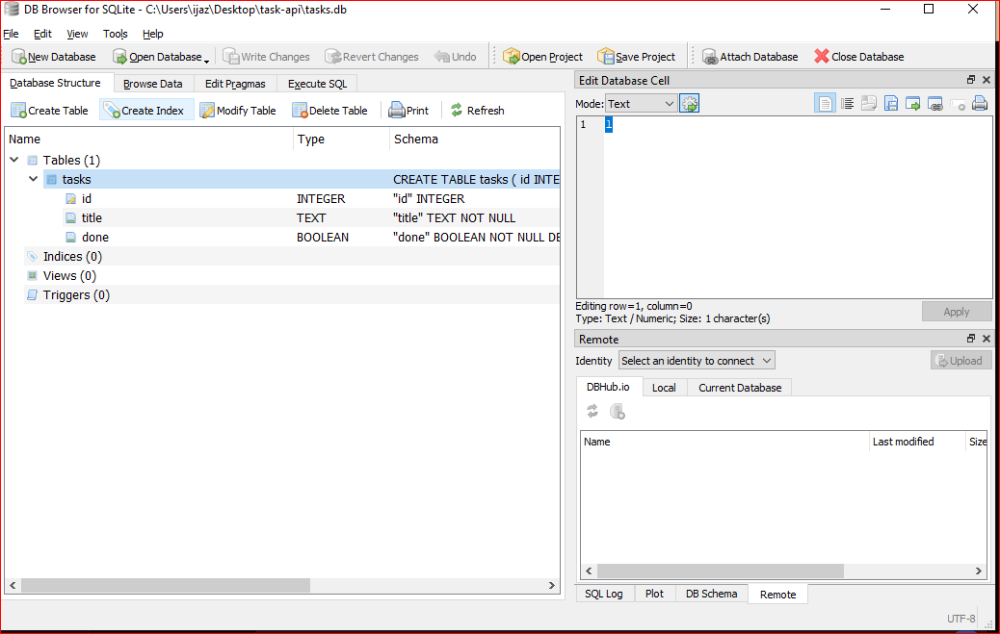

````markdown
## Run the API

Start the server with:

```bash
uvicorn main:app --reload
````

The API will run at:

[http://127.0.0.1:8000](http://127.0.0.1:8000)

## Swagger UI

Open the interactive API documentation at:

[http://127.0.0.1:8000/docs](http://127.0.0.1:8000/docs)

Swagger UI allows all CRUD operations to be tested using the **Try it out** button.

## API Endpoints

| Method | Endpoint      | Description                       |
| ------ | ------------- | --------------------------------- |
| GET    | `/`           | Returns API information           |
| GET    | `/health`     | Checks whether the API is running |
| GET    | `/tasks`      | Returns all tasks                 |
| GET    | `/tasks/{id}` | Returns a single task             |
| POST   | `/tasks`      | Creates a new task                |
| PUT    | `/tasks/{id}` | Updates an existing task          |
| DELETE | `/tasks/{id}` | Deletes a task                    |

## HTTP Status Codes

| Status Code | Meaning            |
| ----------- | ------------------ |
| 200         | Successful request |
| 201         | Task created       |
| 204         | Task deleted       |
| 400         | Invalid request    |
| 404         | Task not found     |

## Validation

The API validates incoming task data.

A missing or empty `title` returns a **400 Bad Request** response.

An unknown task ID returns a **404 Not Found** response.

## Example: Create a Task

```powershell
$body = '{"title":"Buy milk"}'
curl.exe -i -X POST http://127.0.0.1:8000/tasks -H "Content-Type: application/json" -d $body
```

Example response:

```json
{
  "id": 4,
  "title": "Buy milk",
  "done": false
}
```

The response status is **201 Created**.

## Data Storage

Tasks are stored in an **in-memory Python list**. No database is used for this assignment. Tasks are reset when the server restarts.

## Swagger Screenshot


## GitHub Repository

[https://github.com/Usman-4773/task-api](https://github.com/Usman-4773/task-api)

```

**Important:** the screenshot line assumes you have renamed your screenshot folder to `screenshots`.
```
## SQLite Database

### Why SQLite?

SQLite was chosen because it is lightweight, requires no separate database server, and stores the entire database in a single file. It is suitable for this project while providing real persistent database storage.

### Database Location

The SQLite database is stored in:

`tasks.db`

The application automatically creates the database and the `tasks` table when it starts if they do not already exist.

### Running the Project

Activate the virtual environment:

```powershell
.\.venv\Scripts\Activate.ps1


````markdown
## Run the API

Start the server with:

```bash
uvicorn main:app --reload
````

If `uvicorn` is not recognized, use:

```powershell
.\.venv\Scripts\python.exe -m uvicorn main:app --reload
```

The API will run at:

[http://127.0.0.1:8000](http://127.0.0.1:8000)

## Swagger UI

Open the interactive API documentation at:

[http://127.0.0.1:8000/docs](http://127.0.0.1:8000/docs)

Swagger UI allows all CRUD operations to be tested using the **Try it out** button.

## API Endpoints

| Method | Endpoint      | Description                       |
| ------ | ------------- | --------------------------------- |
| GET    | `/`           | Returns API information           |
| GET    | `/health`     | Checks whether the API is running |
| GET    | `/tasks`      | Returns all tasks                 |
| GET    | `/tasks/{id}` | Returns a single task             |
| POST   | `/tasks`      | Creates a new task                |
| PUT    | `/tasks/{id}` | Updates an existing task          |
| DELETE | `/tasks/{id}` | Deletes a task                    |

## HTTP Status Codes

| Status Code | Meaning            |
| ----------- | ------------------ |
| 200         | Successful request |
| 201         | Task created       |
| 204         | Task deleted       |
| 400         | Invalid request    |
| 404         | Task not found     |

## Validation

The API validates incoming task data.

A missing or empty `title` returns a **400 Bad Request** response.

An unknown task ID returns a **404 Not Found** response.

## Example: Create a Task

```powershell
$body = '{"title":"Buy milk"}'

curl.exe -i -X POST http://127.0.0.1:8000/tasks -H "Content-Type: application/json" -d $body
```

Example response:

```json
{
  "id": 4,
  "title": "Buy milk",
  "done": false
}
```

The response status is **201 Created**.

## Data Storage

Tasks are stored in a **SQLite database** named `tasks.db`.

SQLite was chosen because it is lightweight, requires no separate database server, and stores the database in a single file.

The database is stored in the project root directory:

```text
task-api/
├── main.py
├── tasks.db
├── README.md
├── requirements.txt
└── screenshots/
```

The application automatically creates the database and the `tasks` table when it starts if they do not already exist.

Three example tasks are inserted only when the `tasks` table is empty.

## SQLite Database

### Database Schema

The `tasks` table contains:

| Column  | Type    | Description                                    |
| ------- | ------- | ---------------------------------------------- |
| `id`    | INTEGER | Primary key that uniquely identifies each task |
| `title` | TEXT    | Task title                                     |
| `done`  | BOOLEAN | Indicates whether the task is completed        |

### Persistence

Unlike an in-memory list, SQLite stores the tasks permanently in `tasks.db`.

Tasks remain available after the FastAPI server is stopped and restarted.

## SQL Queries

### List all tasks

```sql
SELECT * FROM tasks;
```

### Show completed tasks

```sql
SELECT * FROM tasks WHERE done = 1;
```

### Count all tasks

```sql
SELECT COUNT(*) FROM tasks;
```

### Mark every task as completed

```sql
UPDATE tasks SET done = 1;
```

### Delete all completed tasks

```sql
DELETE FROM tasks WHERE done = 1;
```

## Database Screenshot



## Swagger Screenshot


## GitHub Repository

[https://github.com/Usman-4773/task-api](https://github.com/Usman-4773/task-api)

```

**Important:** If your existing README already has a `Data Storage` section saying **“in-memory Python list”**, delete that old section and use the new one above.
```
## A3 — Containerized Stack

### Overview

This version of the Task API replaces the previous in-memory storage with a PostgreSQL repository and runs the complete application stack using Docker Compose.

### Architecture

* **FastAPI application:** Python + FastAPI
* **Database:** PostgreSQL 16
* **Containerization:** Docker
* **Orchestration:** Docker Compose
* **Database driver:** psycopg2
* **Configuration:** `.env`
* **Database initialization:** `init/01-create-table.sql`
* **Persistent storage:** Docker named volume `postgres_data`

### Environment Configuration

The PostgreSQL connection string is stored in `.env`:

`DATABASE_URL=postgresql://postgres:postgres@db:5432/taskdb`

`.env` is excluded from Git using `.gitignore`.

A committed `.env.example` provides the same configuration format without exposing application secrets.

### PostgreSQL Repository

The application now uses a `TaskRepository` backed by PostgreSQL instead of the previous in-memory storage.

The service and API routes were kept unchanged while the storage implementation was switched to PostgreSQL, demonstrating the repository-layer architecture from A2.

### Docker Compose

The application and PostgreSQL database are defined together in `docker-compose.yml`.

The stack can be started with:

```bash
docker compose up -d
```

The FastAPI application is available at:

`http://127.0.0.1:8000`

Swagger documentation is available at:

`http://127.0.0.1:8000/docs`

### Persistence Proof

Persistence was tested using the following process:

1. Started the application and PostgreSQL database with Docker Compose.
2. Created a task through the API:

   * Title: `A3 Docker Persistence Test`
3. Confirmed the task using `GET /tasks`.
4. Stopped and removed the containers using:

```bash
docker compose down
```

5. Started the stack again using:

```bash
docker compose up -d
```

6. Called `GET /tasks` again.

The task was still present after the containers were recreated:

```json
[
  {
    "id": 1,
    "title": "A3 Docker Persistence Test",
    "done": false
  }
]
```

This proves that PostgreSQL data persisted across the container restart because the database uses the Docker named volume `postgres_data`.

### A3 Requirements Completed

* PostgreSQL runs in Docker with a persistent volume.
* Application and database start through Docker Compose.
* Database connection is configured through `.env`.
* `.env` is gitignored.
* `.env.example` is committed.
* Database table is created through an initialization SQL file.
* PostgreSQL repository replaces the previous in-memory repository.
* API routes and service behavior remain unchanged.
* Data persistence was verified after stopping and restarting the containers.
