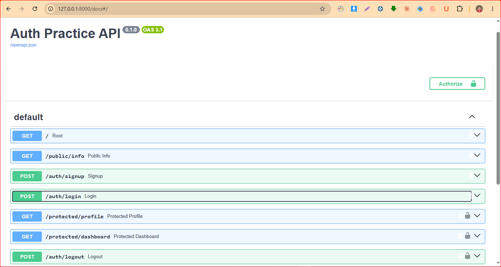

# BE-03 Auth — Login & Protect

A secure authentication API built with **FastAPI** and **Supabase Auth**. This project demonstrates user signup, login, JWT authentication, protected API routes, reusable authentication dependencies, logout, and Swagger UI documentation.

## Tech Stack

* Python 3.10+
* FastAPI
* Supabase Auth
* JWT Bearer Tokens
* python-dotenv
* Swagger UI
* Git & GitHub

## Features

* User signup
* User login
* Supabase JWT access tokens
* Refresh tokens
* Protected profile endpoint
* Protected dashboard endpoint
* Reusable FastAPI authentication dependency
* Logout endpoint
* Public endpoint
* Swagger UI authentication

## Project Structure

```text
task-api/
├── main.py
├── requirements.txt
├── .env.example
├── .gitignore
├── Dockerfile
├── docker-compose.yml
├── init/
│   └── 01-create-table.sql
└── screenshots/
    └── swagger-auth.png
```

## Environment Variables

Create a `.env` file in the project root:

```env
SUPABASE_URL=your_supabase_project_url
SUPABASE_KEY=your_supabase_key
```

The `.env` file contains private configuration and must not be committed to GitHub.

An example configuration is provided in `.env.example`.

## Installation

Create a virtual environment:

```bash
python -m venv .venv
```

Activate the environment on Windows PowerShell:

```powershell
.\.venv\Scripts\Activate.ps1
```

Install dependencies:

```bash
python -m pip install -r requirements.txt
```

## Run the API

Start the FastAPI server:

```bash
uvicorn main:app --reload
```

The API will be available at:

```text
http://127.0.0.1:8000
```

Swagger UI:

```text
http://127.0.0.1:8000/docs
```

## API Reference

| Method | Endpoint               | Authentication | Purpose                        |
| ------ | ---------------------- | -------------- | ------------------------------ |
| GET    | `/`                    | No             | API status                     |
| GET    | `/public/info`         | No             | Public information             |
| POST   | `/auth/signup`         | No             | Create a user account          |
| POST   | `/auth/login`          | No             | Login and receive JWT          |
| GET    | `/protected/profile`   | Bearer Token   | Get authenticated user profile |
| GET    | `/protected/dashboard` | Bearer Token   | Access protected dashboard     |
| POST   | `/auth/logout`         | Bearer Token   | Logout authenticated user      |

## Authentication Flow

1. A user signs up using `/auth/signup`.
2. Supabase Auth creates the account.
3. The user logs in using `/auth/login`.
4. Supabase returns an access token and refresh token.
5. The client sends the access token using the HTTP Authorization header:

```text
Authorization: Bearer <access_token>
```

6. Protected endpoints verify the token with Supabase.
7. Valid tokens allow access.
8. Missing, invalid, or expired tokens return `401 Unauthorized`.

## Protected Routes

### GET `/protected/profile`

Requires a valid Bearer token.

Successful response:

```json
{
  "id": "user-id",
  "email": "user@example.com",
  "created_at": "2026-08-29T18:18:09.051252+00:00"
}
```

### GET `/protected/dashboard`

Requires a valid Bearer token.

Successful response:

```json
{
  "message": "Welcome to your protected dashboard!",
  "user_id": "user-id",
  "email": "user@example.com"
}
```

### POST `/auth/logout`

Requires a valid Bearer token and returns:

```text
204 No Content
```

## Status Codes

| Status | Meaning                                           |
| ------ | ------------------------------------------------- |
| 200    | Successful request                                |
| 201    | User successfully created                         |
| 204    | Successful logout                                 |
| 400    | Missing or invalid input                          |
| 401    | Missing, invalid, or expired authentication token |

## Testing

The API was tested using Swagger UI and curl.

### Valid Token

A valid Supabase access token successfully accesses:

```text
GET /protected/profile
GET /protected/dashboard
```

and returns:

```text
200 OK
```

### Invalid Token

Changing one character of the access token causes the protected endpoint to return:

```text
401 Unauthorized
```

with:

```json
{
  "error": "Invalid or expired token"
}
```

### Missing Token

Accessing a protected endpoint without an Authorization header returns:

```text
401 Unauthorized
```

with:

```json
{
  "error": "Access token required"
}
```

## Swagger UI

Swagger UI is available at:

```text
http://127.0.0.1:8000/docs
```

The protected routes support Bearer Token authorization through the Swagger **Authorize** button.



## Security

* Supabase Auth manages user authentication.
* Passwords are not stored directly by this API.
* JWT access tokens are verified through Supabase.
* Protected routes require authentication.
* Private environment variables are stored in `.env`.
* `.env` is excluded from Git using `.gitignore`.
* Access tokens and private keys should never be committed to GitHub.

## Assignment

**Assignment:** BE-03 — Auth: Login & Protect
**Track:** Backend AI Engineering
**Week:** 4

The project demonstrates authentication, authorization, JWT verification, protected routes, reusable FastAPI dependencies, logout, and Swagger documentation.

## Author

Muhammad Usman
